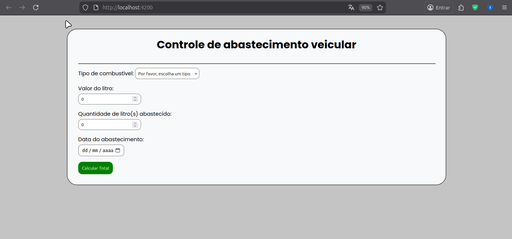

# Sistema de controle de abastecimento de veiculos

## Sumário:
1. [Pré-requisitos](#pré-requisitos)
2. [Como clonar](#clone-o-projeto)
3. [Como instalar as dependências](#instale-dependencias)
5. [Como 'rodar' o projeto](#rode-o-projeto)
6. [Imagens do sistema](#imagens-do-sistema)
7. [Discentes](#discentes)
## Pré-requisitos
```bash
 node -v
 npm -v
```
>Instale o Node.js no site oficial. 

E também o Angular CLI:
```bash
npm install -g @angular/cli
ng version #verifique se deu tudo certo :)
```

### Clone o projeto

```bash
git clone https://github.com/dev-poliana-escolar/controle-de-abastecimento-veiculos.git

cd controle-abastecimento/
```

### Instale dependencias
```bash
npm install
```

### Rode o projeto
```bash
ng serve # ou npm start
```
Acesse no navegador: http://localhost:4200/

### Imagens do sistema

### Discentes
Maria Poliana Pinheiro de Paiva \
Matheus Eduardo Carneiro da Silva \
Jackson Marques de Oliveira

